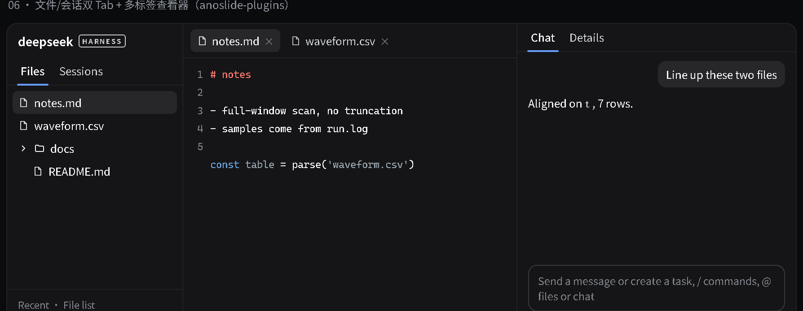

# anoslide-plugins

> **Archived (2026-09-28)**: no longer maintained; superseded by [dsh-vk-suite](https://github.com/Ln1m/dsh-vk-suite).

[中文](README.md) · English



*Mockup: layout rendered from the official theme tokens, not a screenshot of a running instance.*

Two plugins under the `@anoslide` namespace that together form a VS Code-like layout.

| Package | Side | Role |
|---|---|---|
| `dsh-host-files` | host | `/vscode-files/*` HTTP API: list, read / write, create / rename / delete, file search and highlighting, Office conversion (web view / original-layout PDF), session-visible files and root management, skill and MCP management, global persona injection |
| `dsh-client-vscode-layout` | client | Three-column layout (left: "Files / Sessions" tabs; middle: multi-tab viewer; right: "Chat / Details" tabs) with recent files and a file list on the landing page |

## Install

```sh
dsh plugin --profile web add file:<this repo>/dsh-host-files
dsh plugin --profile web add file:<this repo>/dsh-client-vscode-layout
```

Restart the web instance afterwards.

## Configuration

| Item | Where | Default |
|---|---|---|
| Global persona file | `~/.dsh/global-persona.md` | empty (editable in the panel) |
| Landing-page roots for the file tree | `HOME_DIRS` in `dsh-client-vscode-layout/lib/client.js` | `[]` — add your own directories |
| Desktop shortcut entry | `DESKTOP_HINT` in the same file | `D:\Desktop`, shown only if it exists |

## Requirements

- Client plugins depend on the official UI packages (`@deepseek-ai/dsh-client-ui-*`), provided by the DSH runtime
- Office / Visio preview uses a local headless LibreOffice (`LIBREOFFICE_PATH` can point at soffice); Word additionally has an Office-COM web view; unsupported cases degrade with an error
