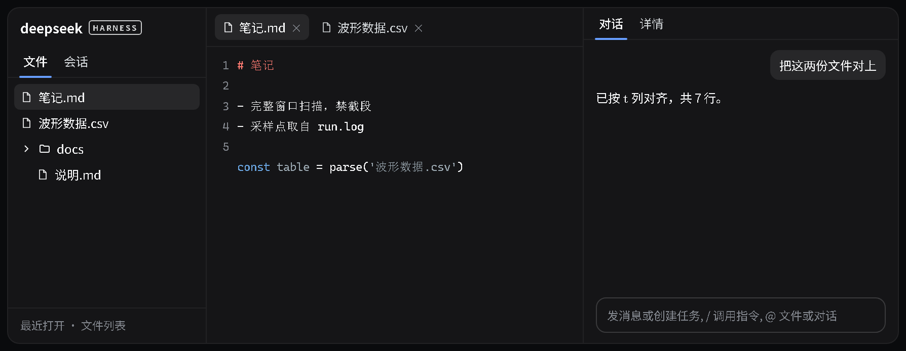

# anoslide-plugins

> **已归档（2026-09-28）**：本仓不再维护，功能由 [dsh-vk-suite](https://github.com/Ln1m/dsh-vk-suite) 取代。

[English](README.en.md) · 中文



*界面示意：按官方主题变量渲染的版式，非实机截图。*

`@anoslide` 命名空间的两个插件，合起来是一套 VS Code 式布局。

| 包 | 端 | 作用 |
|---|---|---|
| `dsh-host-files` | host | `/vscode-files/*` HTTP 接口：列目录、读 / 写文件、新建 / 改名 / 删除、文件搜索与高亮、Office 转换（网页视图 / 原版式 PDF）、会话可见文件与根目录管理、Skill 与 MCP 管理、全局人设注入 |
| `dsh-client-vscode-layout` | client | 三栏布局（左「文件 / 会话」双 Tab、中多标签查看器、右「对话 / 详情」Tab），落地页含最近打开与文件列表 |

## 装

```sh
dsh plugin --profile web add file:<本仓库>/dsh-host-files
dsh plugin --profile web add file:<本仓库>/dsh-client-vscode-layout
```

装完重启 web 实例。

## 配置

| 项 | 位置 | 默认 |
|---|---|---|
| 全局人设文件 | `~/.dsh/global-persona.md` | 空（面板里可编辑） |
| 文件树落地页常用根 | `dsh-client-vscode-layout/lib/client.js` 的 `HOME_DIRS` | `[]`，按需补自己的目录 |
| 桌面快捷入口 | 同文件 `DESKTOP_HINT` | `D:\Desktop`，探测存在才显示 |

## 前提

- DSH 的 client 插件依赖官方 UI 包（`@deepseek-ai/dsh-client-ui-*`），由 DSH 运行时提供
- Office / Visio 预览靠本机 LibreOffice headless（`LIBREOFFICE_PATH` 可指定 soffice 路径）；Word 另有走 Office COM 的网页视图；转不出来时该类型报错降级
